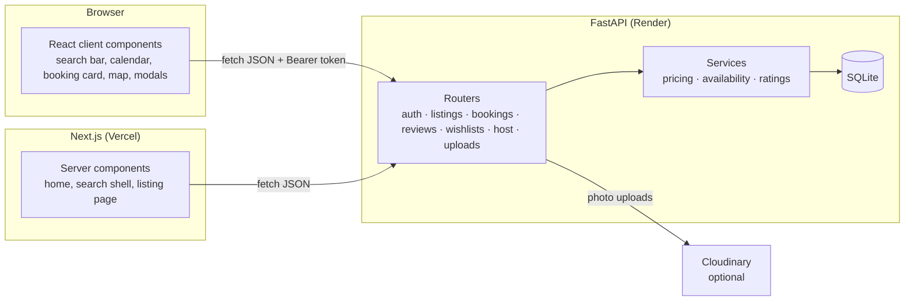
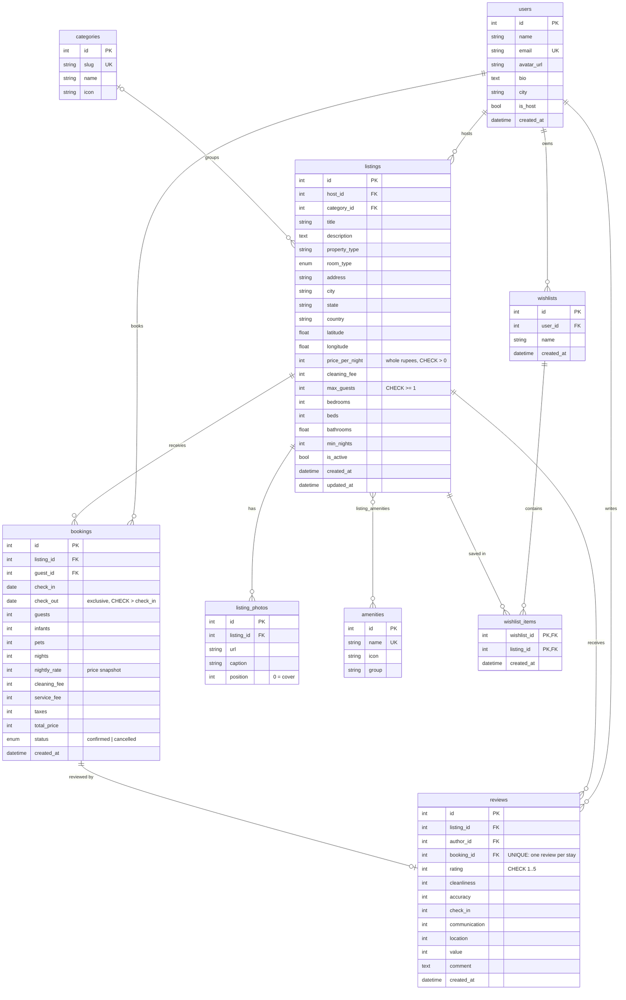

# Airbnb Clone

A full-stack clone of Airbnb's web app. Guests can search and filter stays, browse them on a map, book dates (with no double-booking possible), manage their trips, leave reviews and save wishlists. Hosts can create, edit and delete their own listings and see their reservations.

- **Live demo:** https://airbnb-clone-anahat.vercel.app
- **API docs (Swagger):** https://airbnb-clone-api-t2cu.onrender.com/docs
- **Note:** the API runs on Render's free tier and sleeps when idle — the first request after a while can take ~50 seconds.

**Demo accounts** (no passwords — use the one-click buttons in the login modal):

| Account | Email | What to try |
|---|---|---|
| Aarav (guest) | `guest@demo.com` | Book a stay, see Trips (upcoming, in progress, past and cancelled), write a review for a finished stay, browse wishlists |
| Priya (host, Superhost) | `priya@demo.com` | Host dashboard, reservations, create/edit/delete listings |

Any other email creates a new guest account; "Become a host" turns it into a host.

---

## Tech stack

| Layer | Choice | Why |
|---|---|---|
| Frontend | **Next.js 16** (App Router, TypeScript), **Tailwind CSS v4** | Server-rendered public pages with streaming skeletons, client components for interactivity |
| Maps | **Leaflet** + react-leaflet, Esri street tiles | Free, no API key; price pins, popups and "search as I move the map" |
| Dates & icons | date-fns, lucide-react | Small, tree-shakeable |
| Backend | **FastAPI** + **SQLAlchemy 2.0** + Pydantic v2 | Typed request/response models, automatic OpenAPI docs, dependency injection for auth |
| Database | **SQLite** (WAL mode, foreign keys on) | Required by the brief; schema below |
| Tests | pytest + FastAPI TestClient | End-to-end API tests on a freshly seeded database |
| Hosting | Vercel (frontend), Render (backend) | Free tiers |

---

## Running locally

Requirements: **Python 3.12+** and **Node.js 20+**.

```bash
# 1. Backend (http://localhost:8000, docs at /docs)
cd backend
python3 -m venv .venv
source .venv/bin/activate
pip install -r requirements.txt
uvicorn app.main:app --reload       # creates and seeds airbnb.db on first start

# 2. Frontend (http://localhost:3000), in a second terminal
cd frontend
npm install
cp .env.example .env.local          # NEXT_PUBLIC_API_URL=http://localhost:8000
npm run dev
```

Useful commands:

```bash
cd backend && python -m app.seed        # reset the database to fresh seed data
cd backend && python -m pytest -q       # run the API test suite
cd frontend && npm run lint && npm run build
```

### Environment variables

Backend (`backend/.env`, see `backend/.env.example`):

| Variable | Default | Purpose |
|---|---|---|
| `DATABASE_URL` | `sqlite:///backend/airbnb.db` | SQLAlchemy URL |
| `CORS_ORIGINS` | `http://localhost:3000` | Comma-separated frontend origins |
| `CORS_ORIGIN_REGEX` | – | Extra allowed origins, e.g. Vercel previews |
| `SECRET_KEY` | dev value | Signs the mock auth tokens |
| `SEED_ON_STARTUP` | `true` | Seed when the database is empty |
| `PUBLIC_BASE_URL` | `http://localhost:8000` | Used to build URLs for locally stored uploads |
| `CLOUDINARY_CLOUD_NAME`, `CLOUDINARY_UPLOAD_PRESET` | – | When set, photo uploads go to Cloudinary |

Frontend: `NEXT_PUBLIC_API_URL` – the backend's URL.

---

## Architecture



**Backend layout** (`backend/app/`):

```
main.py          app setup, CORS, routers, seed-on-startup
config.py        settings from environment variables
database.py      engine (SQLite pragmas), session dependency
models.py        SQLAlchemy models = the schema
schemas.py       Pydantic request/response models
auth.py          mock auth: signed tokens, current-user / require-host dependencies
serializers.py   ORM -> API shapes, batch-loading ratings to avoid N+1 queries
services/
  pricing.py       the one place the price breakdown is computed
  availability.py  date-overlap rules
  ratings.py       rating aggregation, Guest favourite and Superhost rules
routers/         one file per resource
seed.py          deterministic seed data (dates relative to today)
```

**Frontend layout** (`frontend/src/`):

```
app/                  routes: / · /s · /rooms/[id] · /book/[id] · /trips · /trips/[id]
                      /wishlists · /wishlists/[id] · /host · /host/listings(/new, /[id]/edit)
                      /host/reservations · /account · coming-soon pages
components/
  layout/             Header (expanding search), UserMenu, Footer, MobileNav
  search/             SearchBar, MobileSearch, CategoryBar, FiltersModal, PriceRange, Pagination
  listings/           ListingCard (with photo carousel), ListingRow, HeartButton
  listing/            PhotoGallery, BookingCard, BookingContext, Reviews, Sections
  checkout/ trips/ wishlist/ host/ map/ auth/
  providers/          Auth, Wishlist, Toast and Theme contexts
  ui/                 Calendar, Modal, buttons, counters, avatar, skeletons
lib/                  api client, types, formatting, URL search-state helpers
```

Key decisions:

- **Search state lives in the URL** (`/s?location=Goa&check_in=…&amenities=1,10`). Links are shareable, refresh-safe and work with the back button. The same goes for selected dates on the listing and checkout pages.
- **Public pages render on the server.** The home rows, the search page's filter data and the listing page are fetched in server components and stream in behind skeletons (Next.js 16 Cache Components / Partial Prerendering). User-specific pages (trips, wishlists, host) fetch on the client, because the mock auth token is kept in `localStorage`.
- **The server is the source of truth for money.** The booking card and checkout call `/quote`, and creating a booking recomputes the price with the same `pricing.quote()` function. A booking stores a *snapshot* of the price, so later price edits don't change past bookings.
- **Ratings are aggregated with SQL `GROUP BY`**, not stored as columns, so they can never go stale. Ratings for a whole page of results are loaded in two queries (no N+1).

---

## Database schema



Design notes:

- **Money is stored as integers (whole rupees)** to avoid floating-point rounding.
- **Dates are half-open ranges** `[check_in, check_out)`: a guest checking out on the 10th frees the 10th for the next check-in. Two bookings overlap when `a.check_in < b.check_out AND b.check_in < a.check_out`; only `confirmed` bookings block dates, so cancelling frees them.
- A composite index on `bookings(listing_id, check_in, check_out)` serves the availability checks; `listings(city)` and `listings(price_per_night)` serve search.
- `ON DELETE CASCADE` (enabled with `PRAGMA foreign_keys=ON`) removes a deleted listing's photos, bookings, reviews and wishlist entries. Deleting a listing with upcoming reservations is refused by the API.
- `listing_amenities` and `wishlist_items` are join tables with composite primary keys, so duplicates are impossible.
- CHECK constraints guard the core invariants (positive price, valid dates, rating 1–5) even if a bug slipped past the API validation.

---

## API overview

Interactive docs: `/docs` (Swagger) or `/redoc`. All endpoints are under `/api`. 🔒 = needs `Authorization: Bearer <token>`, 🏠 = host only.

| Method | Path | Description |
|---|---|---|
| POST | `/auth/login` | Log in with an email (mock, passwordless) → `{token, user}` |
| POST | `/auth/signup` | Create a guest account |
| GET | `/auth/me` 🔒 | Current user |
| POST | `/auth/become-host` 🔒 | Switch the account to hosting |
| GET | `/auth/demo-users` | Accounts offered in the login modal |
| GET | `/meta` | Categories, amenities, property types, price histogram |
| GET | `/home` | Home page rows (popular listings per city) |
| GET | `/destinations?q=` | Autocomplete for the "Where" field |
| GET | `/listings` | Search: `location, check_in, check_out, guests, category, min_price, max_price, room_type, property_types, amenities, bedrooms, beds, bathrooms, guest_favourite, sw_lat/sw_lng/ne_lat/ne_lng, sort, page, page_size` |
| GET | `/listings/{id}` | Listing detail: photos, amenities, host, rating breakdown |
| GET | `/listings/{id}/availability` | Booked date ranges for the calendar |
| GET | `/listings/{id}/quote?check_in&check_out` | Price breakdown + whether the dates are free |
| GET | `/listings/{id}/reviews?page` | Paginated reviews |
| POST | `/bookings` 🔒 | Create a booking (validates dates, guests, pets, min nights, overlaps → `409`) |
| GET | `/bookings/me` 🔒 | My trips |
| GET | `/bookings/{id}` 🔒 | One booking (guest or the listing's host) |
| POST | `/bookings/{id}/cancel` 🔒 | Cancel an upcoming booking, freeing its dates |
| POST | `/reviews` 🔒 | Review a completed stay (one per booking) |
| GET/POST | `/wishlists` 🔒 | List / create wishlists |
| GET/PATCH/DELETE | `/wishlists/{id}` 🔒 | View / rename / delete |
| POST | `/wishlists/{id}/items` 🔒 | Save a listing |
| DELETE | `/wishlists/items/{listing_id}` 🔒 | Un-heart a listing |
| GET | `/host/stats` 🏠 | Earnings, upcoming bookings, rating, Superhost status |
| GET/POST | `/host/listings` 🏠 | My listings / create |
| GET/PUT/DELETE | `/host/listings/{id}` 🏠 | Read / update / delete (owner only) |
| GET | `/host/reservations` 🏠 | Bookings on my listings |
| POST | `/uploads` 🏠 | Upload a photo (Cloudinary or local disk) |

**Preventing double bookings:** the availability check and the insert run inside a lock, so two simultaneous requests for the same dates can't both succeed. The second one gets `409 Conflict`. The API runs as a single process, so an in-process lock is enough; with several workers or a database like Postgres you would use a row lock or an exclusion constraint instead.

---

## Features

**Core:** home rows · search bar (where / when / who, with autocomplete and a two-month range calendar) · category row · filters modal (type of place, price histogram slider, rooms and beds, amenities, Guest favourite, property type, live "Show N places" count) · numbered pagination · listing page (photo grid, photo tour and viewer, highlights, description, amenities, inline availability calendar, sticky booking card with price breakdown, reviews with category ratings, map, host card, things to know) · checkout with mock payment · trip confirmation · Trips page · cancellation · wishlists (named lists, heart toggle, wishlist pages with map) · toasts · modals · host dashboard, reservations and listings · 10-step listing wizard (create and edit) with photo upload or URL.

**Bonus:** interactive map with price pins, popups and "search as I move the map" · post-stay reviews · Superhost badges and Guest favourite labels from aggregated ratings · Cloudinary image upload · dark mode (light / dark / system, no flash on load) · responsive design (mobile search sheet, bottom tab bar, swipeable photos, map/list toggle).

**Placeholders ("coming soon"):** messaging, real payments, identity verification, Experiences and Services tabs.

---

## Assumptions and limitations

- **Authentication is mocked**, as the brief allows: logging in only needs an email. Tokens are HMAC-signed (`user_id.signature`) so they can't be forged for another user. Real auth would add passwords/OAuth and httpOnly cookies.
- **Payments are mocked.** No card details are collected; "Confirm and pay" just creates the booking.
- **Fees:** an Airbnb-style 14% service fee and 12% tax are applied to (nights × rate + cleaning fee). Both rates are configurable.
- **Currency is INR** and seed data covers 11 Indian destinations, matching airbnb.co.in.
- **Photos** in the seed data are Unsplash images; avatars come from randomuser.me. The logo is an original mark in Airbnb's colours (not Airbnb's trademarked logo), and the font is Figtree because Airbnb Cereal is proprietary.
- **Hosting on Render's free tier:** the disk is temporary, so the SQLite file (and locally stored uploads) reset when the service restarts. The app re-seeds itself on startup, so the demo always works, but bookings and listings made on the live site won't survive a restart. A persistent disk or a hosted database would fix this. With Cloudinary configured, uploaded photos are stored permanently.
- **Free-tier cold start:** the API sleeps when idle and takes ~30–50 s to wake. The frontend shows a friendly message if the API isn't reachable yet.
- Times are shown as fixed check-in (2 pm) and checkout (11 am) times; time zones are not modelled.

This is an educational project and is not affiliated with Airbnb, Inc.
